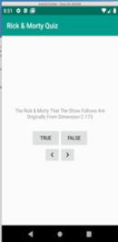

#Android assignment 1
## The Rick and Morty Quiz App

For this assignment you will write an app that implements a quiz. There are several questions they are all true/false questions. You may change the quesiotns to any other topic, or you can use the questions provided. 

Your app should look something liike this 





 
* You must have at least 5 quesitons
* the \> button should load the next question
* the \< button should load the previous 
* the \< and \> buttons should wrap around, so prssing next on the last question should bring you back to the first question, and pressing prev on the first quesion should bring you to the last question. 
* Pressing the True or False buttons causes a toast to come up telling the user if they chose the correct or incorrect answer. 

Clone this repository, do your work in this repository, commit and push to submit. It is best practice to commit and push often. 

## rubric (__/32). 

|  Program functionality 	|  Begining (0) | Novice  (4)|  Competent (6) |  Proficient (8) |
|:-:	|---	|---	|---	|---	|
| comments and Identifier Names	| no comments, many identifier names are meaningless or random   |  some comments, some identifier names are meaningless or random | most required comments, a few identifier names are meaningless or random   | all required comments, all identifier names are meaningful and descriptive.   |
|| || | | 
| desing  	| poor design  	|   	|   |  good desing, good seperation, low coupling, easy to understand |
|  Processing/Algorithm 	|  program does not build, or builds but performs non or few of the processing requirements 	|   program builds and performs some of the required processing	|  program correctly performs most of the required processing 	| program performs all of the required processing correctly and efficiently | 
| Lifecycle events | most lifecycle events not handled | some lifecycle events not handled | program performs most of the lifecycle requirements | program performs all of the lifecycle requirements |


## questions fomrated as strings 

```
    <string name="question_1">The Rick &amp; Morty That The Show Follows Are Originally From Dimension C-173</string>
    <string name="question_2">Jerry\'s Station Wagon Is Based On The Car From National Lampoon\'s Vacation?</string>
    <string name="question_3">Rick &amp; Morty Have Appeared In The Opening Title Screen Of The Simpsons?</string>
    <string name="question_4">Jaguar From \'Pickle Rick\' Had His Own Spin Off Show With Adult Swim?</string>
    <string name="question_5">Two Brothers\' Is The First Show Rick &amp; Morty Watch On Inter-Dimensional Cable?</string>
    <string name="question_6">According To Dan Harmon, A Schmeckle Is Worth $148?</string>
    <string name="question_7">The Bloomflark Is The Universal Currency For The Galactic Federation?</string>
    <string name="question_8">When Bird-Person Is \'Reborn\' He Is Dubbed Phoenix-Bird?</string>
    <string name="question_9">Doctor Neon Bloom Runs Anatomy Park?</string>
    <string name="question_10">When Snuffles Is Able To Talk, He Changes His Name To Snowball?</string>
    <string name="question_11">"Wubba Lubba Dub Dub" Means \'Let\'s Party\'?</string>
    <string name="question_12">Leading Up To The First Episode, Rick Had Left Beth And The Family For 10 Year</string>
    <string name="question_13">In \'Total Rickall\', The Only Character That Isn\'t A Parasite Is Pencilvester?</string>
    <string name="question_14">Tammy Killed Bird-Person On Their Wedding Day?</string>
    <string name="question_15">When Being Scammed By The Zigereons, Rick\'s Safe Code Is \'1-3-5-3\'?</string>
    <string name="question_16">Ice-T\'s Real Name On Alphabetrium Was H2O-T?</string>
    <string name="question_17">When Jerry &amp; Beth Split Up, Jerry Enters A Relationship With A Krootabulan?</string>
    <string name="question_18">The Episode \'Something Ricked This Way\' Is A Parody Of An Edgar Allen Poe Poem</string>
    <string name="question_19">Rick\'s Hivemind Ex-Lover Is Called Purity?</string>
    <string name="question_20">The Conjoint Twin That Simultaneously Host The News &amp;v A Cooking Show Are Calle Michael &amp; Pichael?</string>

```

## code to make questionBank 
 ```
 private val questionBank = listOf(
        Question(R.string.question_1, false),
        Question(R.string.question_2, true),
        Question(R.string.question_3, true),
        Question(R.string.question_4, false),
        Question(R.string.question_5, false),
        Question(R.string.question_6, true),
        Question(R.string.question_7, false),
        Question(R.string.question_8, true),
        Question(R.string.question_9, false),
        Question(R.string.question_10, false),
        Question(R.string.question_11, false),
        Question(R.string.question_12, true),
        Question(R.string.question_13, false),
        Question(R.string.question_14, true),
        Question(R.string.question_15, false),
        Question(R.string.question_16, false),
        Question(R.string.question_17, true),
        Question(R.string.question_18, false),
        Question(R.string.question_19, false),
        Question(R.string.question_20, true))
        ```
